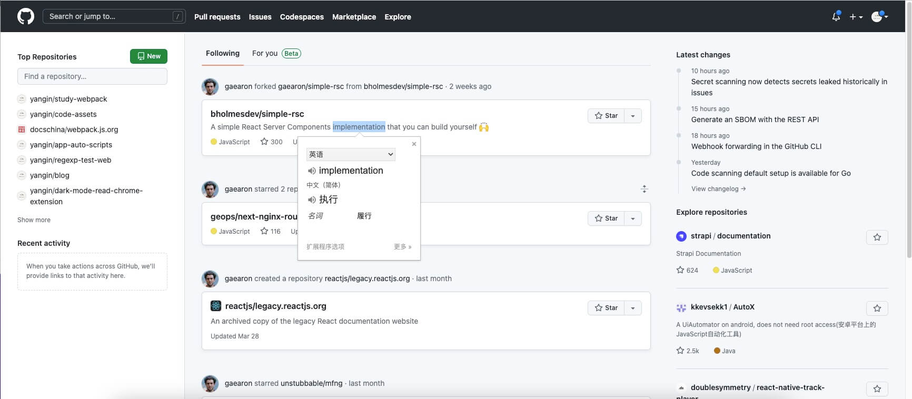
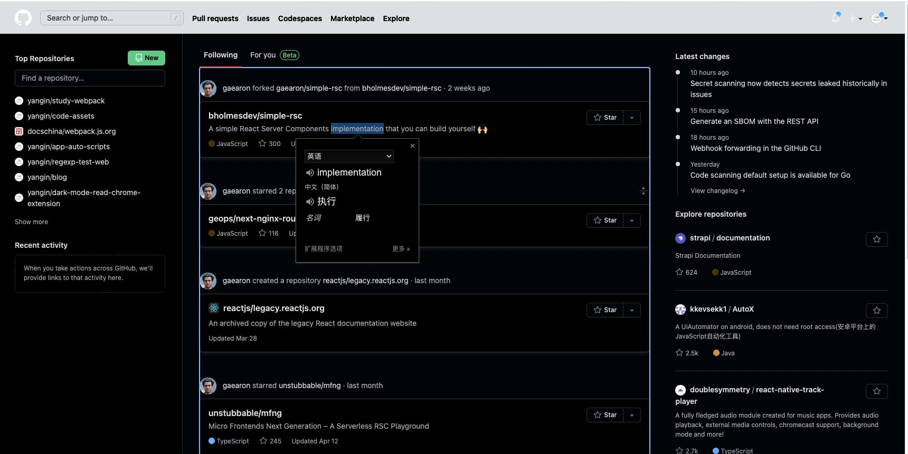
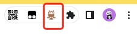

<h2 align="center">Dark Mode Read Chrome Extension</h2>
<p align="center">
  v1.0.0
</p>
This is a chrome extension support reading in dark mode. And is friendly to the popup.
<p align="center">
  <h3 align="center">Before Using the Extension</h3>
  
</p>
<p align="center">
  <h3 align="center">After Using the Extension</h3>
  
</p>

# Installing and Setup

1. Clone this repo

   ```bash
   git clone https://github.com/yangin/dark-mode-read-chrome-extension.git
   ```

2. Open Chrome and go to `chrome://extensions/`

   Turn On `Developer mode`

   Click `Load unpacked`

   And select the folder `dark-mode-read-chrome-extension`

3. Goto any website of choice and click on the extension on top right corner of the browser and click on toggle

   
